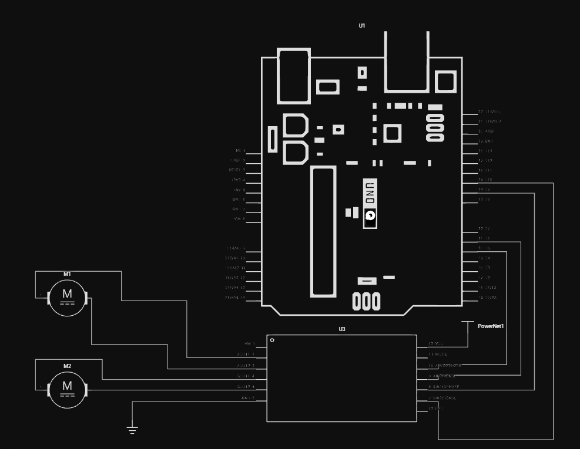

# Corvid Robotics: ClawBot
> A swarm of specialized AI agents that interpret natural language 
> commands and dynamically rewrite robot behavior in real time — 
> no manual coding required.

## Built With
- [OpenClaw](https://openclaw.ai) — Agent framework
- [Arduino Uno Q](https://arduino.cc) — STM32 + Linux SBC
- Telegram — Human interface

## What it is
ClawBot is an intelligent rover controlled by
natural language using Telegram. A swarm of agents on the Arduino 
Uno Q linux chip interpret commands, generate new behavior, 
validate it for safety, and live deploy it to the rover. 
The rover wobbles while it thinks. Then it moves.

## How it works
Telegram → Intent Agent → Blackboard → Codegen Swarm → 
Validator Agent → Flash Agent → Rover behaves differently

## Repo Structure
```
clawbot/
  hardware/
    schematics/
  skills/
  context/
    primitives.md
    base_rules.md
    behavior_template.md
  python/
    main.py
  sketch/
    sketch.ino
    sketch.yaml
  app.yaml
  blackboard.json
  README.md
```

## Blackboard
ClawBot uses a JSON blackboard as shared memory across the agent swarm.
Agents read and write to it to collaborate, wait on dependencies, and 
handle rollbacks.
```json
{
  "robot_id": "rover_01",
  "health": {
    "hardware": "good",
    "alerts": [],
    "last_sensor_reading": {}
  },
  "current_code": {
    "base": {"filename": "base.ino", "hash": "abc123"},
    "behavior": {"filename": "behavior.py", "hash": "xyz789"}
  },
  "tasks": [],
  "override_mode": false
}
```
Tasks follow a dependency chain — a job won't execute until its 
required dependencies resolve with the expected outcome. This is 
how the validator blocks the flash agent from deploying bad code.

## Agents

| Agent | Role |
|-------|------|
| Intent | Parses natural language from Telegram, structures tasks on the blackboard, flags null/ambiguous params |
| Codegen | Swarm of 3 sub-agents (write, review, test) that collaboratively generate behavior.py |
| Validator | Checks generated code against hardware constraints and base.ino rules before allowing flash |
| Comms | Only agent that talks to Telegram — sends status updates, asks clarifying questions, reports alerts |
| Watchdog | Monitors hardware health, sensor readings, raises alerts, can trigger emergency stop |

## Architecture

The STM32 side exposes motor primitives via RPC bridge. The Linux/Python 
side calls these primitives — meaning behavior updates are Python file 
rewrites, not Arduino reflashes. This enables 2-5 second behavior updates 
vs traditional 30+ second compile/flash cycles.

## Demo Capabilities
- Indoor navigation with visual obstacle avoidance
- Follow a specified object
- Immediate stop on command
- Reverse a specified distance
- Turn around
- Learn and follow a face

## Hardware
| Component | Purpose |
|-----------|---------|
| 2WD Acrylic chassis + yellow DC motors w/ encoders | Movement |
| DRV8833 motor driver | Motor control via 4xAA |
| Arduino Uno Q | STM32 + Linux brain |
| Anker 10,000mAh 30W Power Bank | Powers Uno Q + peripherals |
| BENFEI 6-in-1 USB C Hub | Connects power + webcam to Uno Q |
| Logitech HD 1080p USB Webcam | Vision |


## Getting Started
_Coming soon — setup instructions, wiring guide, and skill configuration._

## Where We're Going

ClawBot is the foundation of a larger vision for autonomous robot swarms.

| Milestone | Description |
|-----------|-------------|
| All-weather 4x4 chassis | Ruggedized drive system for outdoor terrain |
| Persistent skills | Always-on capabilities that don't require behavior rewrites — object detection, visual odometry, sensor fusion, tracking, reinforcement learning |
| GPS + path following | Autonomous waypoint navigation and route planning |
| Robot swarms | Multi-robot coordination where ClawBot ecosystems work together |
| Commercial deployment | Night patrol and security rovers for farms and private land |

The end goal: affordable, intelligent, self-coordinating robot swarms 
that can be deployed and retasked in the field using nothing but 
natural language.

## License
[MIT](./LICENSE)
